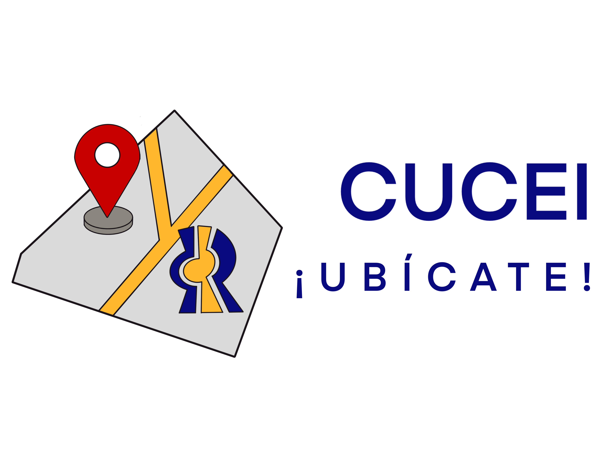
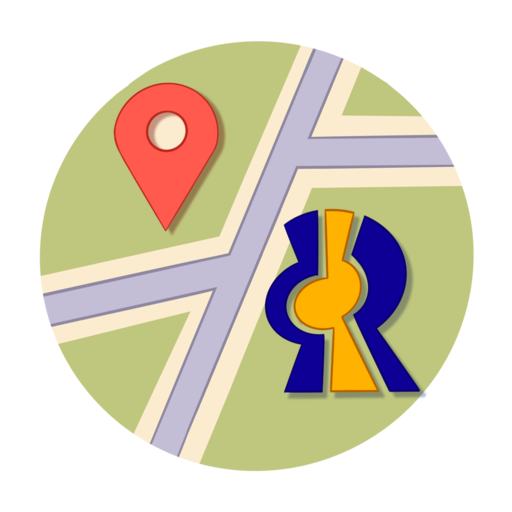

<p align="center">
  
</p>

<h1 align="center">CUCEI Ubicate</h1>

<p align="center">
  
  
  
  
  
</p>

<p align="center">
  <strong>Tu guia interactiva para navegar el campus de CUCEI</strong><br/>
  Centro Universitario de Ciencias Exactas e Ingenierias — Universidad de Guadalajara
</p>

---

## Acerca del Proyecto

**CUCEI Ubicate** es una aplicacion movil pensada para estudiantes, academicos y visitantes del campus CUCEI. Ofrece un mapa interactivo SVG con navegacion inteligente, un chatbot con IA, gestion de perfil academico y acceso rapido a servicios escolares, todo desde tu celular.

<p align="center">
  
</p>

## Funcionalidades Principales

| Funcionalidad | Descripcion |
|---|---|
| **Mapa Interactivo** | Mapa SVG del campus con busqueda de edificios, modulos y puntos de interes |
| **Navegacion A*** | Algoritmo de pathfinding A* para calcular rutas optimas entre ubicaciones |
| **Chatbot IA** | Asistente conversacional integrado con Google Generative AI |
| **Perfil Academico** | Gestion de perfil con malla curricular, carrera y avatares personalizados |
| **Servicios Escolares** | Acceso a CID, servicio medico, servicio social y reconocimiento facial |
| **Becas y Convocatorias** | Informacion actualizada de becas y convocatorias disponibles |
| **CUCEI Radio** | Streaming de la radio universitaria dentro de la app |
| **Directorio** | Contactos y directorio de areas del campus |
| **Onboarding** | Tutorial de primer uso con animaciones Lottie |

## Tech Stack

```
Frontend          React Native 0.76.9 + Expo SDK 52
Navegacion        React Navigation 6 (Stack, Tabs, Drawer)
UI                React Native Paper, Lottie, Reanimated 3
Backend/Auth      Supabase + API REST (ilabtdi.com)
IA                Google Generative AI / Stack AI
Lenguaje          JavaScript + TypeScript
Build             EAS Build (Android SDK 35)
```

## Estructura del Proyecto

```
CUCEIUbicate/
├── App.js                          # Punto de entrada y navegacion raiz
├── Src/
│   ├── auth/                       # Autenticacion y onboarding
│   │   ├── LoginScreen.js
│   │   ├── RegisterScreen.js
│   │   ├── CompleteProfile.js
│   │   ├── OnboardingScreen.js
│   │   └── SessionManager.js
│   ├── Api/
│   │   ├── lib/
│   │   │   ├── api.ts              # Cliente HTTP y funciones API
│   │   │   └── types/              # Definiciones TypeScript
│   │   └── utils/                  # Hashing, comparacion segura
│   ├── Screens/
│   │   ├── Home/                   # Mapa principal del campus
│   │   │   └── Components/
│   │   │       ├── MapComponent/   # SVG del mapa + animaciones
│   │   │       ├── SearchBarsComponent/  # Busqueda y rutas
│   │   │       ├── BottonSheetComponent/ # Info de ubicaciones
│   │   │       └── VideoComponent/ # Videos informativos
│   │   ├── ChatBot/                # Chatbot con IA
│   │   ├── Profile/                # Perfil y mallas curriculares
│   │   ├── ScolarServices/         # Servicios escolares
│   │   ├── Education/              # Radio y becas
│   │   └── community/              # Directorio y articulos
│   └── components/                 # Componentes reutilizables
├── assets/images/                  # Logos e iconos
├── json/                           # Datos locales (contactos, becas, etc.)
├── plugins/                        # Plugins personalizados de Expo
└── scripts/                        # Scripts de utilidad
```

## Instalacion

### Requisitos Previos

- [Node.js](https://nodejs.org/) (v18 o superior)
- [Expo CLI](https://docs.expo.dev/get-started/installation/)
- [Git](https://git-scm.com/)

### Pasos

```bash
# 1. Clonar el repositorio
git clone https://github.com/iLabTDI/CUCEIUbicate.git
cd CUCEIUbicate

# 2. Instalar dependencias
npm install

# 3. Iniciar el servidor de desarrollo
npx expo start
```

Escanea el codigo QR con **Expo Go** en tu celular o ejecuta en un emulador.

### Build de Produccion (Android)

```bash
# Requiere cuenta de Expo y EAS CLI
npm install -g eas-cli
eas build --platform android --profile production
```

## Equipo

Desarrollado por el equipo de **iLab TDI** en CUCEI, Universidad de Guadalajara.

<p align="center">
  
</p>

---

<p align="center">
  Hecho con ❤️ en CUCEI, Universidad de Guadalajara
</p>
